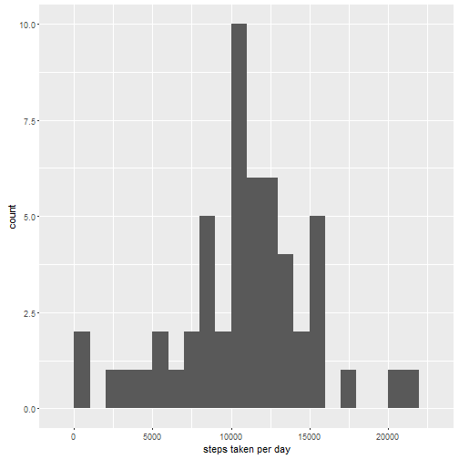

# Introduction

This assignment makes use of data from a personal activity monitoring device. This device collects data at 5 minute intervals through out the day. The data consists of two months of data from an anonymous individual collected during the months of October and November, 2012 and include the number of steps taken in 5 minute intervals each day.

# Loading and preprocessing the data


```r
activityData <- read.csv("activity.csv")
```

# Mean total number of steps taken per day

We calculate the total number of steps taken per day ignoring the missing values


```r
stepsPerDay <- aggregate(steps~date, activityData, sum, na.action = na.omit)
```

We make a histogram of the total number of steps taken each day:


```r
library(ggplot2)
qplot(stepsPerDay$steps, binwidth = 1000, geom="histogram", xlab = "steps taken per day")
```

 

We calculate the mean and median of the total number of steps taken per day ignoring missing values


```r
mean(stepsPerDay$steps, na.rm = TRUE)
```

```
## [1] 10766.19
```

```r
median(stepsPerDay$steps, na.rm = TRUE)
```

```
## [1] 10765
```

# Average daily activity pattern

We make a time series plot of the 5-minute interval (x-axis) and the average number of steps taken, averaged across all days (y-axis)


```r
stepsDaily <- aggregate(steps~interval, activityData, mean, na.action = na.omit)
qplot(interval,steps, data = stepsDaily, geom ="line", xlab = "5-minute interval", ylab = "average number of steps taken")
```

 

Here is the 5-minute interval containing the maximum number of steps:


```r
stepsDaily[which.max(stepsDaily$steps),]
```

```
##     interval    steps
## 104      835 206.1698
```

# Imputing missing values

Here is the total number of missing values


```r
missing <- is.na(activityData$steps)
sum(missing)
```

```
## [1] 2304
```

We decide to fill in all of the missing values in the dataset with the mean for that 5-minute interval


```r
newActivityData <- activityData
for (i in 1:17568) {
  if (missing[i] == TRUE) {
    newActivityData$steps[i] <- stepsDaily[stepsDaily$interval == newActivityData$interval[i],2]
  }
}
```

We make a histogram of the total number of steps taken each day using the new datasets with the missing data filled in


```r
newStepsPerDay <- aggregate(steps~date, newActivityData, sum)
qplot(newStepsPerDay$steps, binwidth = 1000, geom="histogram", xlab = "steps taken per day")
```

 

We compute the mean and median total number of steps taken per day using the new datasets with the missing data filled in


```r
mean(newStepsPerDay$steps)
```

```
## [1] 10766.19
```

```r
median(newStepsPerDay$steps)
```

```
## [1] 10766.19
```

The mean and the median are now closer to each other. The histrogram is also more bell shaped.

# Differences in activity patterns between weekdays and weekends

We create a new factor variable in the dataset with two levels - "weekday" and "weekend" indicating whether a given date is a weekday or weekend day


```r
for (i in 1:17568) {
  if (weekdays(as.Date(newActivityData$date[i])) == "Saturday" | weekdays(as.Date(newActivityData$date[i])) == "Sunday") {
    newActivityData$daytype[i] <- "weekend"
  } else {
    newActivityData$daytype[i] <- "weekday"
  }
}
newActivityData$daytype <- as.factor(newActivityData$daytype)
```

We make a panel plot containing a time series plot of the 5-minute interval (x-axis) and the average number of steps taken, averaged across all weekday days or weekend days (y-axis)


```r
newStepsDaily <- aggregate(steps~interval + daytype, newActivityData, mean)
ggplot(newStepsDaily, aes(interval, steps)) + geom_line() + facet_grid(daytype~.) + xlab("5-minute interval") + ylab("average number of steps taken")
```

 
